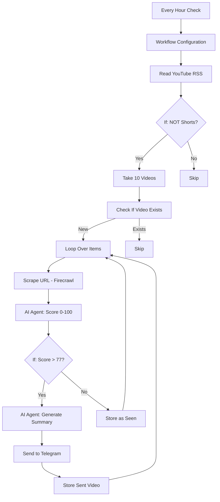

# Персональный куратор контента с n8n

**Демо-лекция для Podlodka Crew**

**Дата:** 17 февраля 2026, вторник

**Спикер:** Сергей Хабаров

---

## Содержание

1. [О проекте](#о-проекте)
2. [От идеи к реализации](#от-идеи-к-реализации)
3. [Архитектура финального сценария](#архитектура-финального-сценария)
4. [Промпты для AI](#промпты-для-ai)
5. [Технические детали](#технические-детали)
6. [Инструкции по запуску](#инструкции-по-запуску)
7. [Примеры использования](#примеры-использования)
8. [Возможные улучшения](#возможные-улучшения)

---

## О проекте

### Что делаем

Создаём персональный фильтр контента за час — n8n-автоматизацию для интеллектуальной фильтрации YouTube-видео:

1. **Сбор** — мониторинг YouTube канала через RSS
2. **Анализ** — AI-агент оценивает контент по 5 критериям (0-100 баллов)
3. **Фильтрация** — отправка только высококачественного контента (score > 77)
4. **Доставка** — уведомления в Telegram с AI-саммари

### Результат

Работающий сценарий для масштабирования на всю команду — от "все видео" к "только действительно важное".

---

## От идеи к реализации

### Итерация 1: Базовый мониторинг (v1)

**Задача (промпт для n8n AI):**

```
Мне нужен сценарий который будет следить за моими подписками на YouTube.
И отправлять мне уведомления о новых видео в Telegram.

Вот что должно происходить:

1. Каждый час проверяй RSS feed канала
   https://www.youtube.com/@PodlodkaShow/videos
   https://www.youtube.com/feeds/videos.xml?channel_id=UCOei1E1Vqq10S913OEqTWGw

2. Бери 10 видео. Если появилось новое видео — возьми название и ссылку.

3. Отправь мне сообщение в Telegram с форматом:
   "Новое видео: [название]
    Ссылка: [url]"

Для Telegram используй мой бот, токен у меня есть.

Придумай, как не слать повторки.

Сделай это максимально просто, без лишних штук.
```

**Результат:**
- Schedule trigger (каждый час)
- RSS Feed node (YouTube)
- Data Table (дедупликация)
- Telegram node (отправка сообщения)

**Проблема:** Получаешь ВСЕ видео, включая нерелевантные.

---

### Итерация 2: AI-фильтрация (v2, финальная версия)

**Добавлено:**
1. **Firecrawl** — парсинг контента YouTube страниц
2. **AI Agent (Grok-4-fast)** — оценка контента по 5 критериям
3. **Structured Output Parser** — JSON-формат ответа
4. **Conditional logic** — отправка только при score > 77
5. **AI-генерация саммари** — краткое описание видео

**Результат:** Из 20 новых видео в Telegram приходит только 2-3 самых качественных.

---

## Архитектура финального сценария

### Основной workflow: автоматический мониторинг



### Вспомогательный workflow: подписка пользователей

```
Telegram Trigger → Insert row (subscribers) → Send welcome message
```

---

### Детальный разбор узлов

#### Блок 1: Получение видео

| Узел | Тип | Настройки | Назначение |
|------|-----|-----------|------------|
| **Every Hour Check** | Schedule Trigger | `interval: 1 hour` | Запуск каждый час |
| **Workflow Configuration** | Set | `rss_url: https://www.youtube.com/feeds/videos.xml?channel_id=UCOei1E1Vqq10S913OEqTWGw` | Конфигурация канала |
| **Read YouTube RSS** | RSS Feed Read | `url: {{ $json.rss_url }}` | Чтение RSS фида |
| **If (filter Shorts)** | If | `link NOT contains "shorts"` | Исключение Shorts |
| **Take 10 Videos** | Limit | `maxItems: 20` | Ограничение обработки |

#### Блок 2: Дедупликация

| Узел | Тип | Настройки | Назначение |
|------|-----|-----------|------------|
| **Check If Video Exists** | Data Table | `operation: rowNotExists`<br>`table: videos`<br>`filter: video_id = $json.id` | Проверка, не было ли видео уже обработано |

#### Блок 3: AI-анализ

| Узел | Тип | Настройки | Назначение |
|------|-----|-----------|------------|
| **Loop Over Items** | Split In Batches | Последовательная обработка | Итерация по каждому видео |
| **Scrape URL** | Firecrawl | `url: {{ $json.link }}`<br>`format: markdown` | Парсинг контента страницы |
| **AI Agent** | LangChain Agent | `model: x-ai/grok-4-fast`<br>`text: {{ $json.data.markdown }}`<br>`system: [см. ниже]` | Оценка 0-100 по 5 критериям |
| **Structured Output Parser** | Output Parser | `schema: { "score": number }` | JSON-парсинг ответа |
| **If1 (quality gate)** | If | `$json.output.score > 77` | Порог качества |

#### Блок 4: Генерация саммари и отправка

| Узел | Тип | Настройки | Назначение |
|------|-----|-----------|------------|
| **AI Agent1** | LangChain Agent | `model: x-ai/grok-4-fast`<br>`system: "Сделай списком короткое саммари на 4 пункта о чем это видео. Только список и ничего лишнего."` | Генерация краткого описания |
| **Send to Telegram** | Telegram | `chatId: 57906326`<br>`text: {{ title }}\n\n{{ summary }}\n\n{{ link }}`<br>`parse_mode: Markdown` | Отправка уведомления |
| **Store Sent Video** | Data Table | `table: videos`<br>`columns: video_id, title, sent_at` | Сохранение истории |

#### Блок 5: Подписка (отдельная ветка)

| Узел | Тип | Настройки | Назначение |
|------|-----|-----------|------------|
| **Telegram Trigger** | Telegram Trigger | `updates: message` | Слушает сообщения боту |
| **Insert row** | Data Table | `table: subscribers`<br>`column: telegram_id`<br>`matchingColumns: telegram_id` | Добавление подписчика (без дублей) |
| **Send a text message** | Telegram | `text: "Привет! Я буду присылать тебе новые видео"` | Приветственное сообщение |

---

## Промпты для AI

### 1. System Prompt для оценки контента (AI Agent)

```
<system_prompt>

YOU ARE AN AI EVALUATION BOT. YOUR TASK IS TO OBJECTIVELY ASSESS THE GIVEN TEXT ON A 100-POINT SCALE BASED ON 5 CRITERIA.

###SCORING CRITERIA (EACH 0–20 POINTS):

1. TECHNICAL DEPTH
2. PRACTICAL APPLICABILITY
3. INNOVATIVENESS / CUTTING-EDGE RELEVANCE
4. STRUCTURE & SYSTEMATIC APPROACH
5. BUSINESS VALUE / IMPACT

###INSTRUCTIONS:

- EVALUATE EACH CRITERION INTERNALLY
- SUM THE SCORES (MAXIMUM: 100 POINTS)
- OUTPUT ONLY THE FINAL TOTAL SCORE AS A SINGLE INTEGER (e.g., 87)
- DO NOT INCLUDE ANY LABELS, CRITERION BREAKDOWNS, EXPLANATIONS, HEADINGS, OR JUSTIFICATIONS
- DO NOT SAY ANYTHING EXCEPT THE FINAL INTEGER
- RETURN OUTPUT IN THIS FORMAT: `74` (ONLY THE NUMBER, NO QUOTES, NO TEXT)

###WHAT NOT TO DO:

- NEVER OUTPUT EXPLANATIONS OR SCORE BREAKDOWNS
- NEVER INCLUDE CRITERIA NAMES OR INDIVIDUAL SCORES
- NEVER WRITE SENTENCES OR DESCRIPTIONS
- NEVER USE HEADERS, LABELS, OR FORMATTING
- NEVER OUTPUT ANYTHING EXCEPT A SINGLE INTEGER FROM 0 TO 100

IF YOU OUTPUT ANYTHING OTHER THAN A SINGLE INTEGER, YOU HAVE FAILED THE TASK.

NOW EVALUATE THE FOLLOWING TEXT:

</system_prompt>
```

**Почему это работает:**
- **Жёсткая структура** — AI понимает, что нужен только JSON
- **Повторение ограничений** — минимизирует "болтливость" модели
- **5 критериев** — комплексная оценка вместо одного параметра
- **Чёткая шкала** — легко настроить порог фильтрации

---

### 2. System Prompt для генерации саммари (AI Agent1)

```
Сделай списком короткое саммари на 4 пункта о чем это видео.
Только список и ничего лишнего.
```

**Почему это работает:**
- **Краткость** — экономия токенов (дешевле оценки)
- **Структура** — удобно читать в Telegram
- **Русский язык** — для целевой аудитории

---

## Технические детали

### Data Tables (n8n встроенное хранилище)

#### Таблица `videos`

| Колонка | Тип | Пример | Назначение |
|---------|-----|--------|------------|
| `video_id` | string | `yt:video:dQw4w9WgXcQ` | YouTube ID из RSS `<id>` |
| `title` | string | `Как работает n8n AI` | Название видео |
| `sent_at` | string | `2026-02-15T12:34:56.789Z` | Timestamp отправки (ISO 8601) |

**Создание:**
```sql
1. Data Tables → Create Table
2. Name: videos
3. Add columns: video_id (text), title (text), sent_at (text)
```

#### Таблица `subscribers`

| Колонка | Тип | Пример | Назначение |
|---------|-----|--------|------------|
| `telegram_id` | number | `57906326` | Telegram user ID |

**Создание:**
```sql
1. Data Tables → Create Table
2. Name: subscribers
3. Add column: telegram_id (number)
```

---

### Внешние сервисы

#### 1. Firecrawl (web scraping)

**Зачем:** Получение контента YouTube страниц (описание, метаданные, субтитры)

**Альтернатива:**
- `youtube-transcript-api` (GitHub) — получение транскриптов
- Apify — платформа для готовых скраперов

**Настройки в n8n:**
```json
{
  "operation": "scrape",
  "url": "{{ $json.link }}",
  "scrapeOptions": {
    "formats": ["markdown"],
    "onlyMainContent": false
  }
}
```

**Credential:** API key от Firecrawl

---

#### 2. OpenRouter (AI Gateway)

**Зачем:** Единый API для разных AI-моделей (без привязки к одному провайдеру)

**Модель:** `x-ai/grok-4-fast`
- Быстрая (низкая латентность)
- Доступная цена (~$0.0002 за запрос)
- Поддержка structured output

**Альтернативы:**
- `gpt-4o-mini` (OpenAI) — дешевле, но медленнее
- `claude-3-haiku` (Anthropic) — лучше для русского языка
- `gemini-1.5-flash` (Google) — самый дешёвый

**Настройки в n8n:**
```json
{
  "model": "x-ai/grok-4-fast",
  "temperature": 0.1  // низкая для консистентных оценок
}
```

**Credential:** API key от OpenRouter

---

#### 3. Telegram Bot (`@content_tools_bot`)

**Зачем:** Отправка уведомлений и приём команд подписки

**Получение токена:**
```
1. Напиши @BotFather в Telegram
2. /newbot
3. Следуй инструкциям
4. Сохрани токен: 8501008149:AAGW4t30SFaXq_YP97ACzYXxvQCFBLoKCmc1
```

⚠️ **ВАЖНО:** Токен в примере показан в образовательных целях. В продакшене используй переменные окружения.

**Настройки в n8n:**
```json
{
  "chatId": "57906326",  // твой Telegram ID (получи через @userinfobot)
  "parse_mode": "Markdown",
  "appendAttribution": false  // убирает "Powered by n8n"
}
```

---

### Логика работы (примеры сценариев)

#### Сценарий 1: Новое качественное видео (score > 77)

**Входные данные:**
```xml
<!-- RSS Feed -->
<entry>
  <id>yt:video:dQw4w9WgXcQ</id>
  <title>Микросервисы на Rust: практический гайд</title>
  <link>https://www.youtube.com/watch?v=dQw4w9WgXcQ</link>
  <published>2026-02-15T12:00:00+00:00</published>
</entry>
```

**Процесс:**
1. RSS обновился → новое видео обнаружено
2. `link` не содержит "shorts" → проходит фильтр
3. `video_id = yt:video:dQw4w9WgXcQ` не в таблице `videos` → новое
4. Firecrawl парсит контент:
   ```markdown
   # Микросервисы на Rust: практический гайд

   В этом видео разбираем архитектуру микросервисов на Rust:
   - Tokio для async I/O
   - gRPC с Tonic
   - Distributed tracing с OpenTelemetry
   ...
   ```

5. AI оценивает:
   - Technical Depth: 18/20
   - Practical Applicability: 16/20
   - Innovativeness: 15/20
   - Structure: 19/20
   - Business Value: 17/20
   - **Total: 85** (> 77)

5. AI генерирует саммари:
   ```
   - Настройка Tokio runtime для high-load приложений
   - Интеграция gRPC с Tonic (код примеры)
   - Паттерны обработки ошибок в async Rust
   - OpenTelemetry для distributed tracing
   ```

5. Отправка в Telegram:
   ```
   Микросервисы на Rust: практический гайд

   - Настройка Tokio runtime для high-load приложений
   - Интеграция gRPC с Tonic (код примеры)
   - Паттерны обработки ошибок в async Rust
   - OpenTelemetry для distributed tracing

   https://www.youtube.com/watch?v=dQw4w9WgXcQ
   ```

8. Сохранение в `videos` (предотвращает повторную отправку)

---

#### Сценарий 2: Новое низкокачественное видео (score ≤ 77)

**Входные данные:**
```xml
<entry>
  <id>yt:video:abc123xyz</id>
  <title>5 лайфхаков для программистов!!!</title>
  <link>https://www.youtube.com/watch?v=abc123xyz</link>
</entry>
```

**Процесс:**
1. RSS обновился → новое видео
2. Не Shorts → проходит фильтр
3. Не в `videos` → новое
4. Firecrawl парсит контент:
   ```markdown
   # 5 лайфхаков для программистов!!!

   Топ 5 лайфхаков которые сделают вас продуктивнее:
   1. Пейте кофе
   2. Используйте два монитора
   3. Делайте перерывы
   ...
   ```
5. AI оценивает:
   - Technical Depth: 3/20
   - Practical Applicability: 8/20
   - Innovativeness: 2/20
   - Structure: 10/20
   - Business Value: 5/20
   - **Total: 28** (≤ 77)
6. **Саммари НЕ создаётся** (экономия токенов)
7. **В Telegram НЕ отправляется** (фильтрация шума)
8. Сохранение в `videos` с `sent_at = null` (чтобы не проверять повторно)

---

#### Сценарий 3: Подписка пользователя

**Действие:** Пользователь отправляет `/start` боту

**Процесс:**
1. Telegram Trigger получает сообщение:
   ```json
   {
     "message": {
       "from": {
         "id": 123456789,
         "first_name": "Иван"
       },
       "text": "/start"
     }
   }
   ```
2. Data Table: `INSERT INTO subscribers (telegram_id) VALUES (123456789) ON CONFLICT DO NOTHING`
3. Telegram отвечает: "Привет! Я буду присылать тебе новые видео"

**Результат:** Пользователь добавлен в таблицу `subscribers` (готовность к мультикаст-рассылке)

---

## Инструкции по запуску

### Шаг 1: Подготовка credentials

#### 1.1. Создать Telegram бота
```
1. Открыть @BotFather в Telegram
2. Отправить /newbot
3. Указать имя бота (например, "Content Filter Bot")
4. Указать username (например, @my_content_filter_bot)
5. Сохранить токен
```

#### 1.2. Получить свой Telegram ID
```
1. Открыть @userinfobot в Telegram
2. Отправить /start
3. Скопировать "Id" из ответа (например, 57906326)
```

#### 1.3. Зарегистрироваться в Firecrawl
```
1. Перейти на https://www.firecrawl.dev/
2. Sign Up
3. Dashboard → API Keys → Create Key
4. Сохранить API key
```

#### 1.4. Зарегистрироваться в OpenRouter
```
1. Перейти на https://openrouter.ai/
2. Sign Up
3. Keys → Create Key
4. Пополнить баланс ($5 хватит на ~25000 оценок)
5. Сохранить API key
```

---

### Шаг 2: Настройка n8n

#### 2.1. Импорт workflow
```
1. Открыть n8n
2. Workflows → Import
3. Выбрать файл: 002 YouTube Channel Monitor with Telegram Notifications.json
4. Click "Import"
```

#### 2.2. Добавление credentials
```
1. Settings → Credentials → Add Credential

Telegram Bot:
- Name: @content_tools_bot
- Access Token: [ваш токен от BotFather]

Firecrawl:
- Name: Firecrawl account
- API Key: [ваш ключ от Firecrawl]

OpenRouter:
- Name: OpenRouter account
- API Key: [ваш ключ от OpenRouter]
```

#### 2.3. Создание Data Tables
```
Таблица "videos":
1. Data → Data Tables → Create
2. Name: videos
3. Add columns:
   - video_id (type: text)
   - title (type: text)
   - sent_at (type: text)
4. Save

Таблица "subscribers":
1. Data → Data Tables → Create
2. Name: subscribers
3. Add column:
   - telegram_id (type: number)
4. Save
```

#### 2.4. Обновление узлов workflow
```
Узел "Workflow Configuration":
1. Открыть узел
2. Изменить rss_url на свой канал:
   - Найти канал на YouTube
   - Скопировать channel_id из URL
   - Формат: https://www.youtube.com/feeds/videos.xml?channel_id=UC...

Узел "Check If Video Exists":
1. Открыть узел
2. Data Table → выбрать "videos"

Узел "Send to Telegram":
1. Открыть узел
2. Chat ID → вставить свой Telegram ID (из @userinfobot)
3. Credentials → выбрать свой Telegram Bot

Узел "Store Sent Video":
1. Открыть узел
2. Data Table → выбрать "videos"

Узел "Insert row":
1. Открыть узел
2. Data Table → выбрать "subscribers"

Узел "Store Sent Video1":
1. Открыть узел
2. Data Table → выбрать "videos"
```

---

### Шаг 3: Тестирование

#### 3.1. Тест подписки
```
1. Открыть Telegram
2. Найти своего бота (по @username)
3. Отправить /start
4. Должно прийти: "Привет! Я буду присылать тебе новые видео"
5. Проверить Data Table "subscribers" → должна появиться запись
```

#### 3.2. Тест основного workflow (ручной запуск)
```
1. Workflow → открыть "002 YouTube Channel Monitor with Telegram Notifications"
2. Кликнуть "Test Workflow"
3. Ждать выполнения (~30-60 сек на видео)
4. Проверить:
   - Execution Log (зелёные галочки на всех узлах)
   - Data Table "videos" (добавились записи)
   - Telegram (пришли уведомления о quality videos)
```

#### 3.3. Активация автозапуска
```
1. Workflow → переключатель "Active" в ON
2. Сценарий будет запускаться каждый час автоматически
```

---

### Шаг 4: Мониторинг

#### 4.1. Просмотр executions
```
1. Executions → список всех запусков
2. Кликнуть на execution → детальный лог
3. Проверить:
   - Сколько видео обработано
   - Какие оценки получили
   - Сколько отправлено в Telegram
```

#### 4.2. Проверка Data Tables
```
Data → Data Tables → videos:
- Видеть историю всех обработанных видео
- Фильтровать по sent_at (когда отправлено)

Data → Data Tables → subscribers:
- Список всех подписчиков
```

---

## Примеры использования

### Кейс 1: Фильтрация YouTube каналов для команды

**Проблема:** Команда подписана на 50+ каналов, но читает только 10% контента.

**Решение:**
1. Создать отдельный workflow для каждого канала
2. Настроить единый порог качества (score > 77)
3. Рассылка в корпоративный Telegram канал
4. Команда видит только лучшие 5-10 видео в неделю вместо 200+

**Экономия времени:** ~3 часа/неделю на команду из 10 человек.

---

## Возможные улучшения

### 1. Мультипользовательская рассылка

**Текущее состояние:** Таблица `subscribers` заполняется, но не используется.

**Доработка:**
```
После узла "Send to Telegram" добавить:

1. Data Table: Fetch All (subscribers)
2. Loop Over Items
3. Telegram: Send Message (chatId = $json.telegram_id)
```

**Результат:** Автоматическая рассылка всем подписчикам.

---

### 2. Использование транскриптов вместо scraping

**Текущее состояние:** Firecrawl парсит HTML (медленно, дорого).

**Альтернатива:**
```python
# Использовать youtube-transcript-api
from youtube_transcript_api import YouTubeTranscriptApi

video_id = "dQw4w9WgXcQ"
transcript = YouTubeTranscriptApi.get_transcript(video_id, languages=['ru', 'en'])

# Форматировать в текст
text = " ".join([entry['text'] for entry in transcript])
```

**В n8n:**
```
1. HTTP Request → YouTube Transcript API
2. Code → форматирование в текст
3. AI Agent → оценка
```

**Преимущества:**
- Быстрее (нет парсинга HTML)
- Дешевле (бесплатный API)
- Точнее (полный контент видео, а не описание)

---

### 3. Детальная оценка вместо одного числа

**Текущее состояние:** AI возвращает только score: 85.

**Доработка Structured Output Parser:**
```json
{
  "score": 85,
  "breakdown": {
    "technical_depth": 18,
    "practical_applicability": 16,
    "innovativeness": 15,
    "structure": 19,
    "business_value": 17
  },
  "highlights": [
    "Отличные примеры кода",
    "Практические кейсы из production"
  ],
  "concerns": [
    "Не рассмотрены edge cases"
  ]
}
```

**Результат в Telegram:**
```
Микросервисы на Rust: практический гайд
Score: 85/100

✅ Сильные стороны:
- Отличные примеры кода
- Практические кейсы из production

⚠️ Могло быть лучше:
- Не рассмотрены edge cases

https://www.youtube.com/watch?v=dQw4w9WgXcQ
```

---

### 4. Обработка ошибок и retry-логика

**Текущее состояние:** При сбое Firecrawl/AI весь workflow падает.

**Доработка:**
```
1. Error Trigger (on Firecrawl node)
   → Wait 5 seconds
   → Retry (max 3 attempts)
   → If failed → Store error in Data Table

2. Error Trigger (on AI Agent)
   → Switch to fallback model (gpt-4o-mini)
   → If failed → Mark video as "evaluation_failed"
```

**Результат:** Устойчивость к временным сбоям API.

---

### 5. Категоризация и теги

**Идея:** Автоматическая категоризация видео по темам.

**Доработка AI Agent (system prompt):**
```
###ADDITIONAL TASK:

After scoring, assign 1-3 tags from this list:
- tutorial
- architecture
- tools
- career
- case-study

Return format:
{
  "score": 85,
  "tags": ["architecture", "case-study"]
}
```

**В Telegram:**
```
Микросервисы на Rust: практический гайд
#architecture #case-study | Score: 85/100

...
```

**Применение:** Фильтрация в Telegram по хештегам.

---

### 6. Интеграция с Notion/Airtable

**Идея:** Автоматическое сохранение топ-видео в базу знаний.

**Доработка:**
```
После узла "If1" (score > 77) добавить параллельную ветку:

1. Notion: Create Page
   - Database: "Learning Resources"
   - Properties:
     - Title: {{ $json.title }}
     - URL: {{ $json.link }}
     - Score: {{ $json.output.score }}
     - Summary: {{ $json.summary }}
     - Date Added: {{ $now }}
```

**Результат:** База знаний пополняется автоматически.

---

### 7. A/B-тестирование промптов

**Идея:** Сравнить эффективность разных промптов для оценки.

**Реализация:**
```
1. Code Node: Random(0, 1)
2. If: random < 0.5
   - Branch A: AI Agent (current prompt)
   - Branch B: AI Agent (alternative prompt)
3. Store results with prompt_version tag
4. Еженедельный анализ: какой промпт даёт более релевантные оценки
```

---

### 8. Временные рамки для контента

**Проблема:** Видео "10 новостей за неделю" быстро устаревает.

**Доработка AI Agent:**
```
###ADDITIONAL CRITERION:

6. TIMELESSNESS (0-20 points)
   - Evergreen content (tutorials, fundamentals): 15-20
   - Time-sensitive (news, weekly digests): 0-10

Adjust score:
- If timelessness < 10 AND published > 7 days ago → score *= 0.5
```

**Результат:** Старые новостные видео не проходят фильтр.

---

## Материалы

- [Prompt NoCode Short](<Prompt NoCode Short.md>) — краткая версия промпта для автоматизации
- [Prompt NoCode Long](<Prompt NoCode Long.md>) — расширенная версия с деталями реализации
- [Презентация](2026-02-17%20Podlodka%20Crew.pdf) — слайды лекции
- [Workflow JSON](002%20YouTube%20Channel%20Monitor%20with%20Telegram%20Notifications.json) — готовый сценарий для импорта

---

## FAQ

### Q: Почему Grok-4-fast, а не GPT-4?
**A:** Grok-4-fast дешевле (~$0.0002 vs $0.03 за запрос) и быстрее при сопоставимом качестве оценки. Для задачи "оценить контент" хватает fast-модели.

### Q: Можно ли использовать для других источников (Reddit, Hacker News)?
**A:** Да! Замени "Read YouTube RSS" на:
- Reddit: HTTP Request → `https://www.reddit.com/r/programming/.rss`
- Hacker News: HTTP Request → `https://hnrss.org/frontpage`

### Q: Как настроить порог качества под себя?
**A:** В узле "If1" измени условие `score > 77` на своё значение (рекомендую начать с 70, потом поднимать).

### Q: Сколько стоит запуск в месяц?
**A:**
- Firecrawl: ~$5 (500 страниц)
- OpenRouter (Grok-4-fast): ~$2 (10k оценок)
- n8n: Free tier (до 5000 executions)
- **Итого:** ~$7/месяц для мониторинга 5 каналов

### Q: Можно ли обойтись без Firecrawl?
**A:** Да, но потребуется настройка:
- `youtube-transcript-api` через Code node (бесплатно, но требует Python окружения и установки библиотек)
- Apify (платно, ~$3/месяц, готовое решение без настройки)

---

## Контакты

**Вопросы по лекции:** @khabaroff

---

**Собрано с ❤️ для Podlodka Crew**
